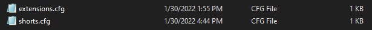
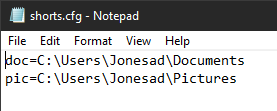
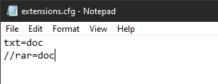

# Welcome to Windows Download Sorter

By default, Windows pushes every downloaded file to the User's Downloads Directory. In most situations, files can be manually redirected to a different location. However, this requires manual user intervention, and thus, is often forgotten (at least in my experience). This program aims to remedy that by providing a light-weight middleman that is configurable based on filetype.

## Usage

Starting the program is as simple as running the exe. To enable on startup, see [Enabling Programs on Startup in Windows 10](https://www.dell.com/support/kbdoc/en-us/000124550/how-to-add-app-to-startup-in-windows-10). By default, this program doesn't do much. Without setting a config file (see [Config](#Config)), It simply monitors for changes in the download directory. After setting up a configuration, it will automatically parse files according to the `extensions.cfg`.

### Manual
In order to manually organize a file in your downloads directory, rename it with the following syntax: `^[directory/shortcut]*`. The square brackets have to be placed at the start of the line. This also works when downloading a file from the internet; simply name it this way in the save file dialog. Moving between directories in the square brackets can be accomplished by adding a `,` between two directory names. 

## Installation

The Program is portable so simply download your preferred release's `.zip` file from the releases page, extract it, and run the `.exe`. 

## Config

Setting up configuration files should be a relatively pain-free task. Simply create a folder called `config` in your `\Downloads\` directory (If you have already run the program, all necessary files should alraedy be created. These files are as follows: 
 

 
Both files follow the same, and following, grammars: 
- `key=val`
- `//This is a comment`
* Comments must be at the start of the line. 
 
However, both files serve two distinct purposes. 

### Shorts.cfg

Let's begin with an example of the `shorts.cfg` file:
 

 

In this file, there are two shortcuts defined. The `doc` key then references `C:\Users\Jonesad\Documents` in the rest of the program. This allows for easier specifications of heavily-nested directories. To use these shortcuts, see [manual usage](#manual), use them in the extensions definitions, or use them in future shortcuts definitions. 

### Extensions.cfg

An example extensions definition is shown below:
 

 
As you can see, this follows the same format as the `shorts.cfg` file. However, it can utilize the shortcuts defined previously. So, according to this example, any file `*.txt` that gets moved into or is created or renamed inside of the downloads Directory, will be immediately moved to the `C:\Users\Jonesad\Documents` directory. *This can cause an issue with the default new option inside of Windows Explorer, as it creates the file, and then initializes a rename dialog*.  
Another interesting thing to note in the above example is that the second line begins with `//`, which signifies a comment. The way files are parsed currently does not allow for inline comments, however if the line starts with `//` it will be ignored.
